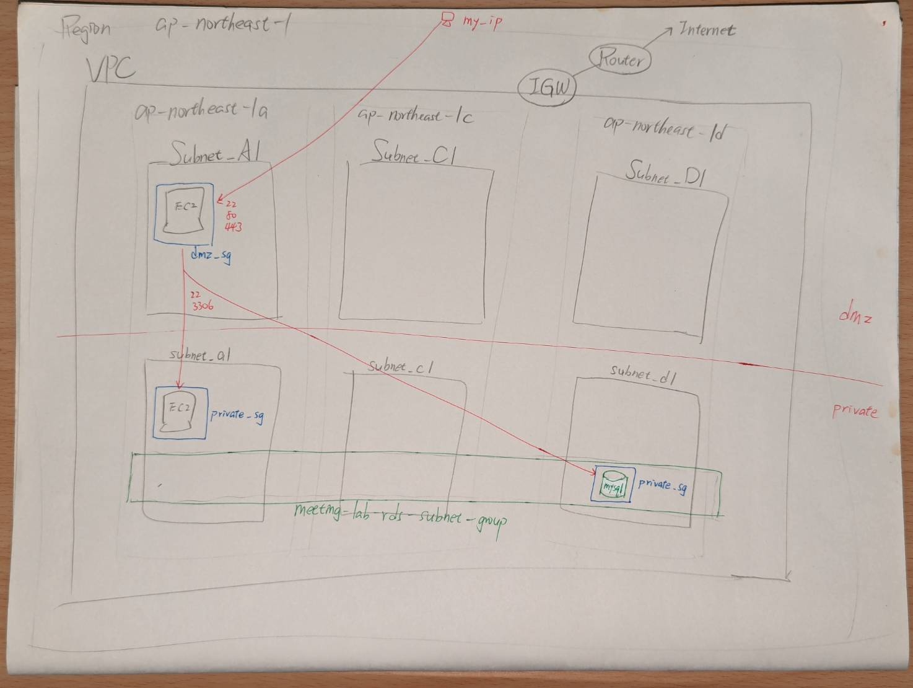

使用 Terraform 建立 VPC Networking

---



開 2 台 EC2

- 一台位於 DMZ, 開放 22/80/443 給 MyIP
- 一台位於 private (只允許由 dmz_sg 的 security group 來訪 22 & 3306 port)

開 1 台 RDS

- 位於 private (只允許由 dmz_sg 的 security group 來訪 22 & 3306 port)

---


## 1. create backend bucket using terraform

```bash
cd backend

# 參考 terraform.tfvars.example
cat terraform.tfvars
# 配置要使用的 backend bucket name

terraform init
terraform plan
terraform apply

```


## 2. create infra using terraform


```bash
cd application

# 參考 terraform.tfvars.example
cat terraform.tfvars
# 配置 my_ip
# 預先建立好 2 把 key-pair
#   一把用來 local -> dmz ec2        - 使用 dmz-key
#   一把用來 dmz ec2 -> private ec2  - 使用 priv-key

terraform init
terraform plan
terraform apply
```


## 3. verify

```bash
cat connection.json | jq
```


## 4. scripts

```bash
cd script

# 可將腳本 scp 到 Ubuntu (CentOS 因沒要求, 尚未做過嚴謹測試)
scp script/*.sh ubuntu@xxx.xxx.xxx.xxx:/home/ubuntu/.

# 進入遠端機器後
sudo -i
chmod 700 *.sh

### 安裝 Nginx
./1-install-nginx.sh

### 配置 virtual host 到 /etc/nginx/conf.d/example.com.conf 
./2-generate-vhost.sh example.com

### 針對運行在 8080 port 的服務做檢測, 失敗則重啟(重複 60次)
./3-health-check.sh nginx
./3-health-check.sh AppName
```
